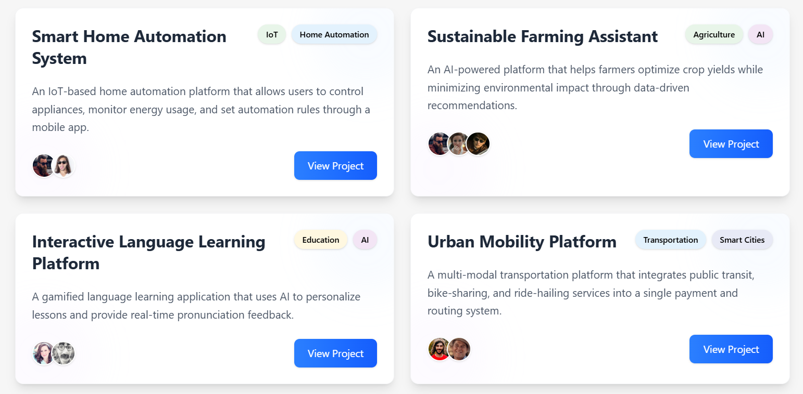
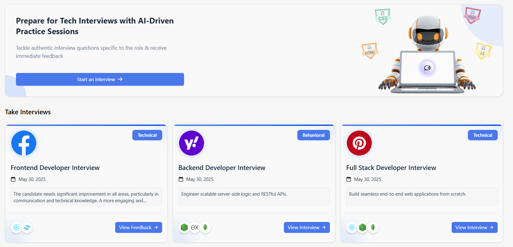
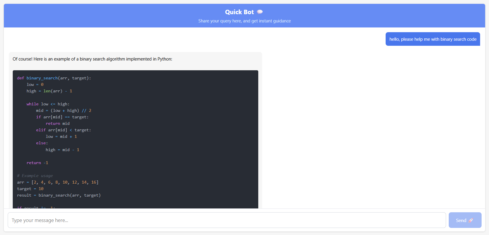
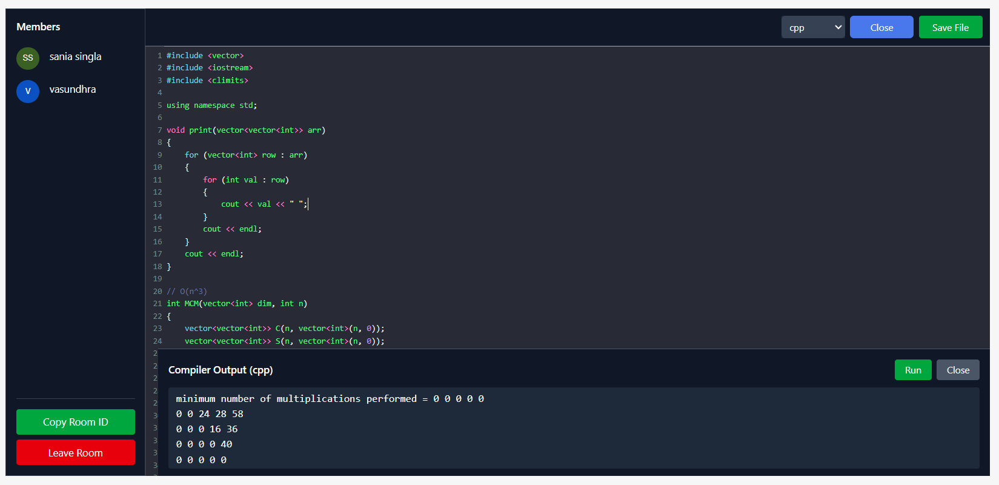
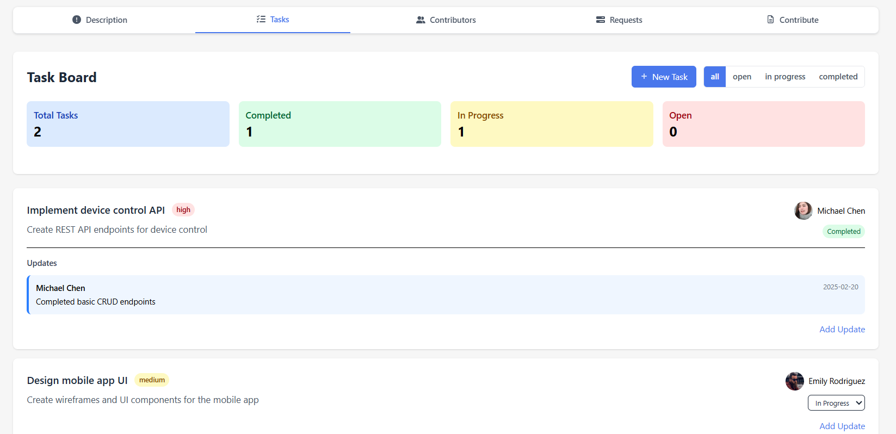
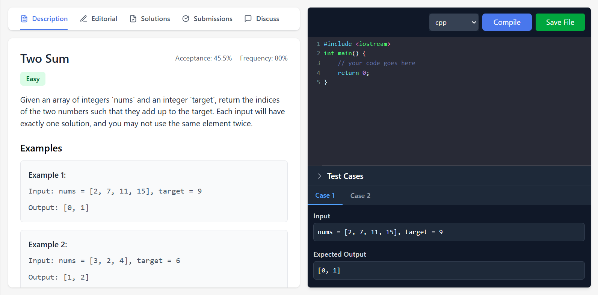

# 🤝 Peer Connect  
**Real Projects. Real Teams. Real Growth.**  
*Empowering students to collaborate, contribute, and grow — together.*

---

## 🚀 Overview

**Peer Connect** is a **modular, beginner-friendly, and cloud-based collaboration platform** built specifically for students.  
From launching authentic projects to building industry-ready skills, Peer Connect equips learners with **the tools, teams, and support** they need — all in one space.  

It's not just a learning platform. It’s a **student-first ecosystem** that helps you turn ideas into impact.

---

## ❓ Problem We Solve

🎓 Learning is often **isolated, competitive, and placement-obsessed**  
🧑‍🤝‍🧑 **Small contributions go unrecognized**, killing student motivation  
📌 No common space for **discovering projects, collaborators, and mentors**  
🛠️ Existing tools are **fragmented, expensive, and not student-centric**  
🚧 Beginners struggle to **start meaningful work** or gain real-world experience

---

## 💡 Our Solution

**Peer Connect bridges that gap** by empowering students to:

- 🤝 **Collaborate in real-time** on authentic projects with teammates  
- 🧠 **Use AI tools** to prepare smarter: resume building, mock interviews, contributor matching  
- 🗂️ **Assign roles, manage tasks**, and track project progress transparently  
- 📥 **Resolve doubts fast** via integrated peer & mentor support  
- ✍️ **Showcase skills** through blogs, coding profiles, and community activity  

---

## 🌟 Key Features

---

### 🛠️ Project & Contributor Finder  
AI-based matching with projects that suit your skills  


---

### 🧠 AI-Powered Mock Interviews  
Role-specific interview prep tailored to your goals  


---

### 📄 Resume Builder & Reviewer  
Tech-ready templates + AI feedback to stand out  

---

### 📥 Quick Doubt Resolution  
Fast peer/mentor answers for smooth learning  


---

### ✍️ Real-Time Collaborative Editor  
Work on code/docs with teammates instantly  


---

### 🗃️ Taskboard Management  
Assign, organize, and track tasks Kanban-style  


---

### 💬 Instant Chat Support  
Group and 1:1 chats for better team communication  

---

### 📚 Company-Wise Interview Prep  
Practice problems based on real tech hiring patterns  


---

### 🕹️ Gamified Web Dev Learning  
Interactive challenges with rewards for progress  

---

### 🧠 Centralized Coding Profile  
Showcase coding activity synced from multiple sites  

---

### 📝 Social Blogging Platform  
Share experiences, insights, and portfolio-worthy posts  

---


## 💎 Why Peer Connect Stands Out

- ✅ **Student-First, Always** – Built for learners at every level  
- 🧰 **Utilizes Open Source AI Tools** – Scalable, free, and future-ready  
- 💸 **Completely Free** – Because education shouldn't cost dreams  
- 🧩 **Modular Architecture** – Use what you need, when you need it  
- 🌍 **Global Accessibility** – Cloud-based and device-friendly  
- 🤝 **Real Collaboration** – Not just content consumption, but co-creation  
- 🛠️ **Built With Purpose** – Not a placement hub, but a growth community

---

## 🧪 Tech Stack

| Layer       | Tools Used                                    |
|-------------|-----------------------------------------------|
| 🎨 Frontend | React.js, Tailwind CSS                         |
| 🧠 Backend  | Node.js, Express.js                            |
| 💾 Database | MongoDB                                       |
| 🎥 Video/Chat | WebRTC, Socket.io                            |
| 🔐 Auth     | JWT, OAuth                                    |
| 🧠 AI Tools | Open Source APIs (mock interviews, resume reviews, matching) |
| 📄 Docs     | Puppeteer + Handlebars                         |
| ☁️ Hosting  | Cloudflare / Vercel / Render                   |

---

## 🌈 Our Vision

To turn **every student** into a confident contributor — by giving them the tools, teammates, and trust to build real things.

---

## 🛠️ Getting Started

Follow these steps to run Peer Connect on your local machine:

### 1. 🚀 Clone the Repository

```bash
git clone https://github.com/Sania-Singla/PeerConnect.git
```
```bash
cd PeerConnect
```

### 2. 📦 Install Dependencies

#### *Run the following command in command prompt (don't use powershell)*

```bash
npm i && npm --prefix client i && npm --prefix server i 
```

### 3. 🧪 Run the App

```bash
npm run dev 
```

- This will start the app in development mode. Visit http://localhost:5173 in your browser.

### 4. ⚙️ Environment variables
Make sure you set up your .env file correctly


### 5. 📁 Folder Structure
#we are following the MVC pattern
<pre>PeerConnect/
├── client/                         # Frontend (React)
│   ├── public/                     # Static assets (favicon, index.html, etc.)
│   ├── src/                        # React source code
│   │   ├── components/             # Reusable UI components
│   │   ├── pages/                  # Page-level components/routes
│   │   ├── services/               # Backend interaction logic
│   │   ├── contexts/               # Global context/state
│   │   └── ...                     # Main.jsx, App.jsx, etc.
│   ├── .env                        # Frontend environment config
│   └── package.json                # Frontend dependencies
│
├── server/                         # Backend (Node.js + Express)
│   ├── public/                     # Static assets
│   ├── src/                        # Node source code
│   │   ├── controllers/            # Logic for DB and API handling
│   │   ├── routers/                # API route definitions
│   │   ├── models/                 # Mongoose schemas
│   │   ├── interfaces/             # Interface definitions
│   │   ├── middlewares/            # Authentication, validation, etc.
│   │   ├── utils/                  # Utility/helper functions
│   │   └── server.js               # Main server entry point
│   ├── .env                        # Backend environment config
│   └── package.json                # Backend dependencies
│
├── .gitignore                      # Files to ignore in Git
├── README.md                       # Project documentation
└── package.json                    # Root-level commands (like npm run dev)
</pre>

## 🏁 Final Note for Hackathon Judges

🎯 **Peer Connect** addresses real, lived problems in student learning.  
⚙️ It’s **modular, scalable, and AI-integrated**, with real-world use cases.  
🌱 It empowers early learners and advanced contributors **alike**.  

We aren’t just solving for placements —  
**We’re building a culture of collaboration, contribution, and confidence.**


